[Source](https://www.edrawsoft.com/article/class-diagram-relationships.html)

Table of Content
```toc
```

## Association
Any link between two static classes that interact with each other in one of the following ways:

### Unidirectional Association
This association represents the flow of information between two classes. When an **Object** contains another **Object** in its fields. The **container class** is the class that 

"The association is represented by a solid line and an arrow pointing towards the container classifier."

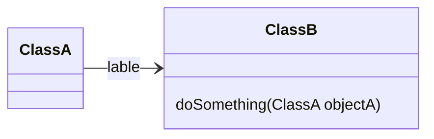

==PROBLEM==
The book contradicts it:
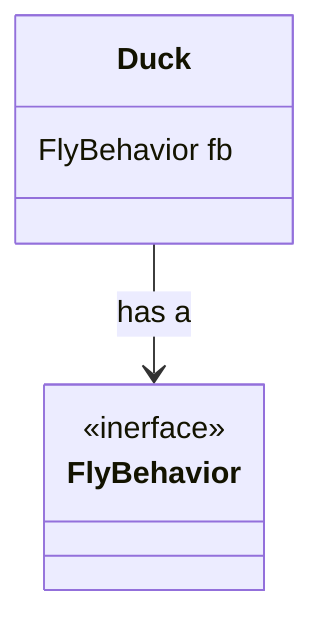


#### RL Example
The `Cow` object uses the `Farm` object to get milked
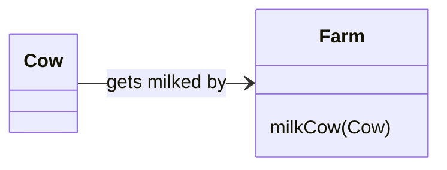


### Bidirectional Association
This association happens when the two classes are closely associated with each other. They are also able to store the other into their fields. 

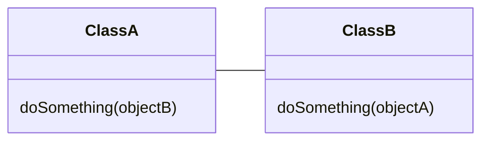

### Aggregation
This relationship is a type of association where a class has another class in its fields. In other words, the container class, `ClassX`, 'has a' different class, `ClassY` which completes it. The difference with Composition is that the class that's being contained, `ClassY`, can live within the system, usually because it could be used somewhere else in the system. The hallow diamond is in the container class.

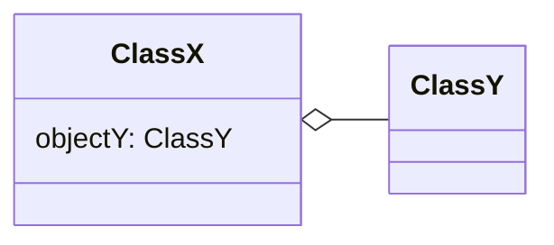

#### RL Example
The `Farm` class is a place where all the cows are organized for milking. So the `Farm` is not working properly without the `Cow` objects, but the `Cow` is still useful to the system since it can be used for other things like eating the grass to keep it trim.

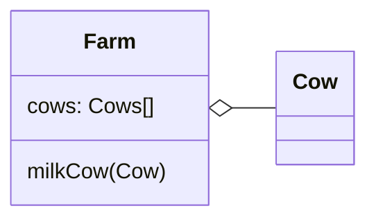


### Composition
This relationship is a type of association where a focal class (`ClassX`) not only uses another class (`ClassY`), but it also makes them, so if the focus class object is deleted, all the `ClassY` objects get deleted as well. The composition relationships are represented by a solid line and a filled diamond shape drawn near the containing class.

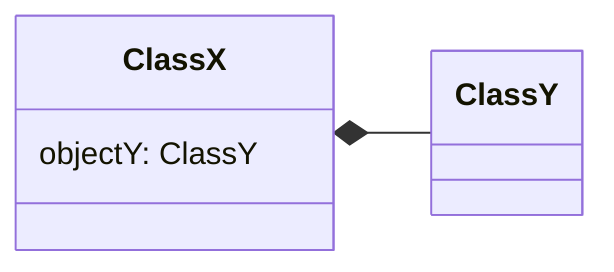

#### RL Example
The `Farm` crates `FarmTools` that are very specific for whatever the need at the moment. If the fence is falling apart, the farmers will create a hammer big enough to redo the fence, if there are too much weed in the farm land, the farmers will make tools to cut the weed. This tools will be created in the `Farm` class. Since they are very specific to the Farm's need, if the Farm object is deleted there's nothing we can do with the FarmTools, so they get deleted as well making this a Composition relationship

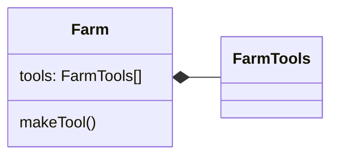


## Generalization / Inheritance
Also known as inheritance. This relation is used to represent a **Parent Class** and a **Child Class**. The **Child Class** will inherit all the **Parent Class** attributes, operations, and relations. The **Parent Class** can have multiple **Child Classes**, as well as the **Child Class** can have multiple **Parent Classes**.

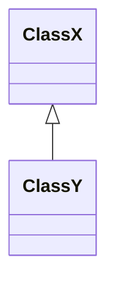

#### RL Example
An `Animal` is the general way of classification of many things, a more specific `Animal` would be a `Zebra` or a `Tiger`. So all `Zebra` classes and `Tiger` classes would inherit all the `Animal` behaviors and operations.

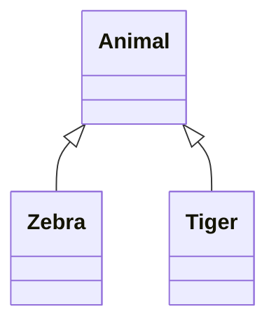


## Realization
An Interface can be described as a contract that binds a class into implementing certain operations. Its naming convention is, usually but not always, something that does (e.i. Runnable, Comparable, Runnable)
This relationship is used with interfaces. When a class, `ClassX`, implements or realizes certain behavior from an interface, `InterfaceY`, it means it needs to implement the interface's operations to fulfil the contract. The realization is represented by a dashed line with a hollow arrow.

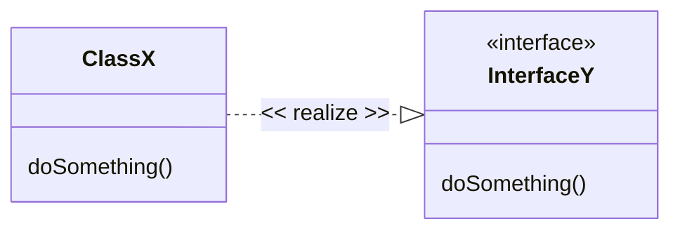

#### RL Example
The `Car` class implements the operation go which come from the interface `MobilityBehavior` 

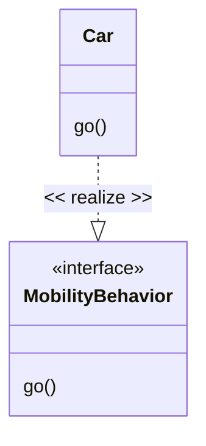

## Dependency
Using another class doesn't mean having it, or depending on it. But any changes in ClassY makes you also change have to change ClassX then we have a dependency association.

"This is a weaker relationship type used when an object is not contained in any field. The dependency relationship will exist that change to one class will cause change to the other entity. It is represented by a dashed line and an arrowhead pointing towards the dependent entity."

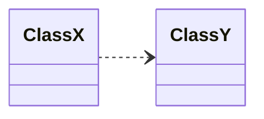

#### RL Example
In this example, we have a dependency relationship because if the `MilkBottle` class changes, it might affect the way it is being stored in the `MilkStorage` class. It's a weak relationship because the dependent class, `MilkBottle`, is not contained in any field of `MilkStorage`.
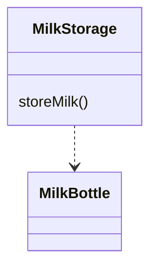


## Transition

"In UML modeling, the transition state is used to connect two composites/states directly. The states are credited as the major transition and main source of a transition. A solid line with a filled arrow is used to represent the change of control between two classes. Above the arrow, the event is labeled that causes this transition."

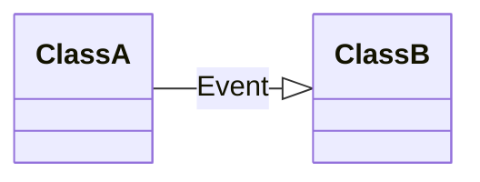


## Activity Edges
"The activity diagram is an essential type of UML diagram used to represent the flow between different activities of a system. They aid in understanding the logic behind the algorithm of a system. The activity flow is represented by a solid line with a filled arrowhead pointing towards the next activity in the sequence."

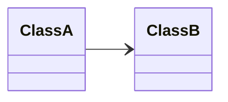


## Questions for Reddit

# H1
## H2
### H3
#### H4
###### H5
This is another test. The only problem is that this program doesn't always c.
![[Untitled Diagram.svg]]
This is 11:10