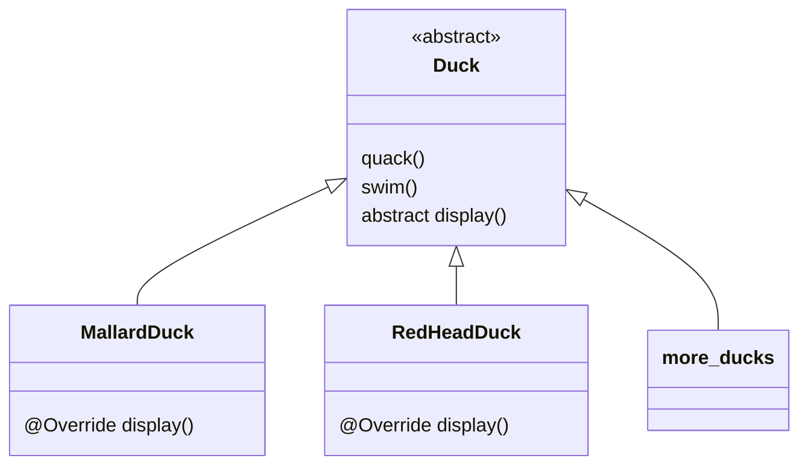
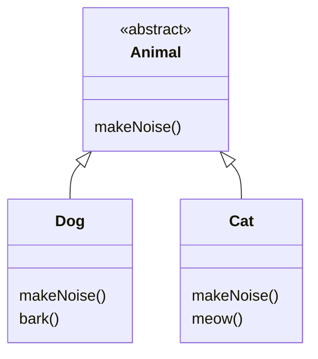
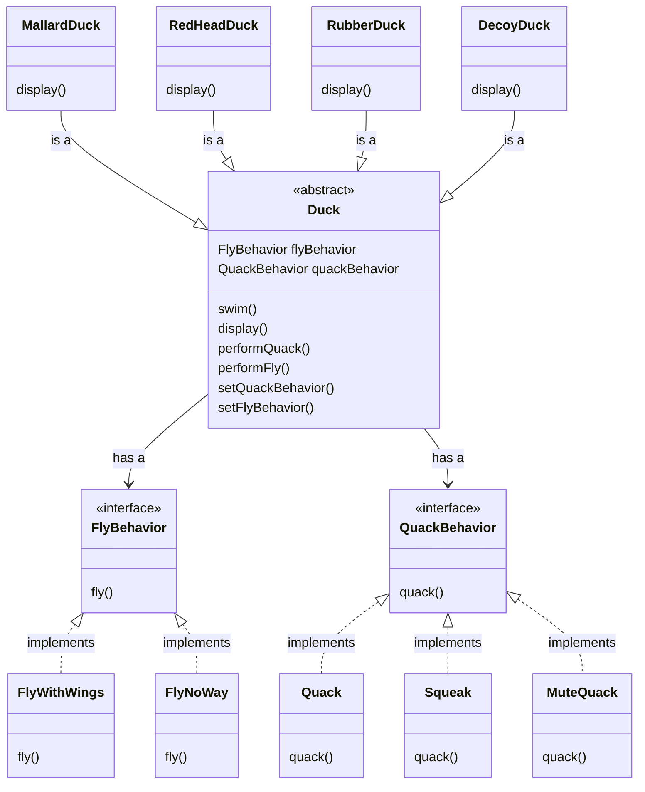
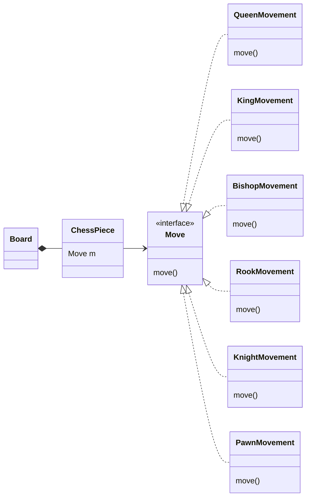

Table of Content
```toc
```
---
## Definition
Defines a family of algorithms, encapsulates each one, and makes them interchangeable. Strategy lets the algorithm vary independently from clients that use it.

### On My Words
This pattern is used when you notice a part of the code that might need a different behavior in the future. For example, Chess. We could hard code every piece, but there would be a lot of duplicate code, so we can use the Strategy Pattern to make the pieces modular and add the correct behavior.

---
## Example
Problem:
We have a Duck simulation app, and ==the client is asking us to add new behaviors starting with a fly behavior.== We are given this code.



### Design Principle 1
Identify the aspect of the application that vary and separate them from what stays the same.

### Design Principle 2
Program to an interface, not an implementation.

<u>"Program to an implementation"</u>
```Java
Dog d = new Dog();
d.bark;
```
This is wrong because it forces us to code to a concrete implementation which is not flexible.

<u>"Program to an interface"</u>
```Java
Animal animal = new Dog();
animal.makeSound();
```



### Design Principle 3
Favor composition over inheritance.


### Solution



---
## Demo

Make a Chess app with the assumption that it will grow in the future, adding different modes.



If in the future we decided to expand the application to include new modes, we can do it with the **Strategy Pattern**, which adds flexibility to the code.

## Tutorial Videos

Ideas for video: 
- 2 videos, one short for students who forgot to study just before testing and an in-depth video for better understanding and more formal
	- Short video, quick 2-5 minute video highlighting the essentials for using the given pattern
	- Long video, 10 -15 minutes that add formal definitions and use all the examples on the reference book

What are the functions available to me:
1. I can zoom in
2. I can focus on mouse

### Short Video
What would a student appreciate just before an example.
- Fast pace.
- Straight to the point.
- Anecdotes—a short amusing or interesting story about a real incident or person
- Memorable examples.

Highlights
- What problem does it solve (When to use it)
- What's important about it (Why use it)
- How it solves it ()

#### Script
- Hello all, this is a quick just-before-exam video about the Strategy Pattern using the Head First Design Patterns Book as a reference.
- The formal definition is: ==The Strategy Pattern defines a family of algorithms, encapsulates each one, and makes them interchangeable. Strategy lets the algorithm vary independently from clients that use it==.
- We're going to keep that at the top for later reference.
- **So what problems does the Strategy Pattern solves?**
		- Imagine you are trying to simulate different types of ducks.
		- If we know anything about code it is that change is inevitable, so we have to predict where it is going to happen, and by doing this we make the code easily extensible and flexible for adding or deleting functions later.
	
- **But why would you want to use the Strategy Pattern?**
	- This would decrease the number of unintended consequences of code changes and make your overall system more flexible.  
	
- **How do you use the Strategy Pattern?**
	- Going back to the duck example. All the types of ducks look different, some have different ways of flying, quacking, and swimming. 
	- Which gets us to our first ==Design Principle: Identify the aspects of your application that vary and separate them from what stays the same.==
	- >show graphic of the behaviors being separated from the duck<
	- Now, we can use that to isolate and encapsulate our behaviors:
		- >picture of behaviors being separated from the book< pg 10
		- `displayBehavior(), flyBehavior(), quackBehavior(), swimBehavior()`
	- Now to implement them we take into consideration our second ==Design Principle: Program to an interface, not an implementation.==
	- what does this mean? It means we use the interface to clearly define whats being expected from the defined behavior. 
		- >Use UML class diagram to show the behaviors in interfaces.< pg 22 

### Long Video

#### Script

This is the script that ill be working on from now on. The end goal is to add every detail of the video tutorial that I'm planning to do about design patterns. I was thinking in using one note because of how good it is adding different kind of notes like pictures and even videos. But they still lack the style that I found in here. Right now I'm looking how to add images to this thing. Might still be a better choice for what I want to do. I don't know why I'm battling using OneNote so much, but I kinda like this better. 

I was looking a little into aseprite again, and I'm going to have to do some research to relearn what I was doing in it. Not to mention the programming side of it in Unity3D. 

New day, new opportunitiess. What am I doing today? First I need to plan the day, so this is why I'm doing this. At least I'm making some progress, as small as it is. First, When I'm sitting in the only thing that ill be doing is work. Any type of work counts, but only work. Right now, is an example of the work I'm talking about. This keyboard feels weird, so I might change it for the other one and use this one for gaming. Same with the mouse, it's just a little weird. Then again, what comes to mind is that its just a way to distract mmyself from the real problem which is to finaly start being profuctive.

Anyways, the **TO-DO** of today is to do something about the design patterns. Keep doing the script untill you have perfeted everything about it. Also need practice doing some animations. Might use PowerPoint i dont know yet.

Right now, the problem I see is with images. Not exactly image, but drawings of what I want to do.

### Test images

![[Pasted image 20230318133956.jpg | 500 ]]
This is an image, I can't resize it. Nevermind, problem fixed.

# Heading 1
## Heading 2
### Heading 3
